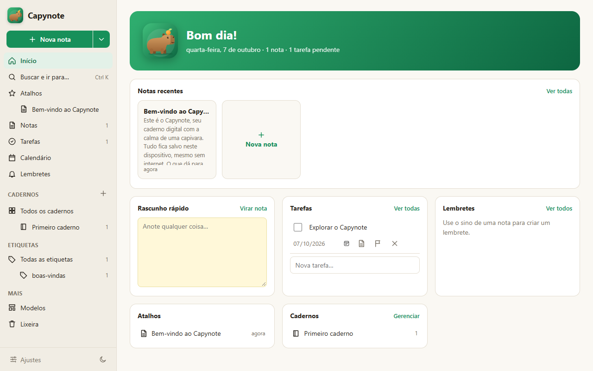

# Capynote

App de notas com cadernos, etiquetas, tarefas, lembretes e calendário. Funciona no navegador e pode ser instalado no celular.

Abrir: https://joaogabrielmontinirossi-sys.github.io/capynote/

## Licença

[MIT](LICENSE): pode usar, copiar, modificar e distribuir livremente, mantendo o aviso de autoria.
